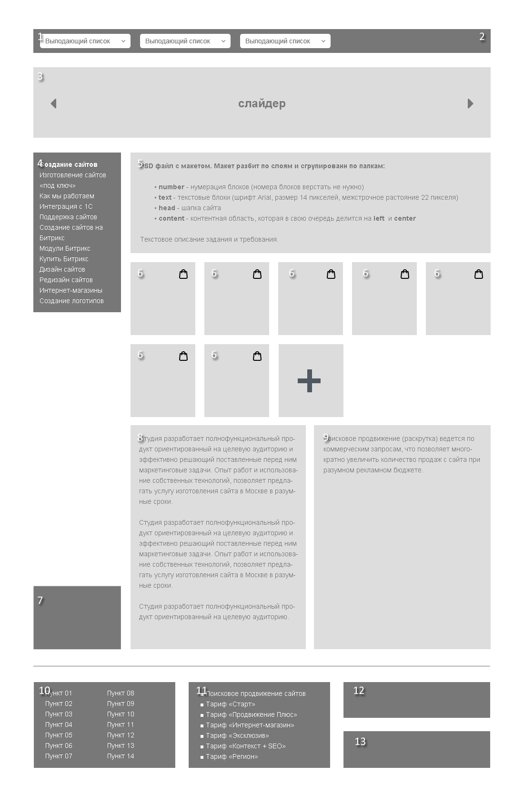

# boroda-test-work
Тестовое задание для "Креативное Агентство BORODA"

## Задачи для верстки

* Макет сделать responsive 320-1920, макет должен корректно отоброжаться на всех современных браузерах, включая ie9+. На retina дисплеях иконки должны оставаться четкими

* Шапка фиксирована сверху c выпадающим списком

* Футер прибит к низу

* Уделить внимание семантике

* При удалении блоков верстка не должна распадаться

* Блок 4 фиксируется при скролле до момента когда блок 7 будет в 20 пикселях снизу от него

* Блоки 6 - должны быть выполнены таким образом, что при добавлении и/или удалении любого кол-ва аналогичных блоков верстка не должна ехать. При этом добавление и/или удаление этих блоков должно быть простым.

* Добавить hover на блоки 4, 7, 10, 11, 12, 13 на свое усмотрение (желательно с анимацией или изменением цвета иконки).

* Добавить hover на блоки 5 - 9 появляется кнопка редактировать ( на 6-ом блоке еще кнопка удалить).

* Блок 7 всегда внизу левой колонки.

## Задачи для Front End

* При скролинге так как header – fixed скрывается слайдер

* В слайдере 3 слайда ( желательно авто перелистывание слайдера )

* Весь контент хранится в json файле (кроме header и footer)

* При нажатии на кнопку редактировать открывается popup с имеющимся текстом в texarea

* При сохранении изменений все записывается в json

* При удалении одного из блоков №6 так же обновляется json файл

* При нажатии кнопки добавления «+» в блоке №6 открывается с popup и записывается в json файл
